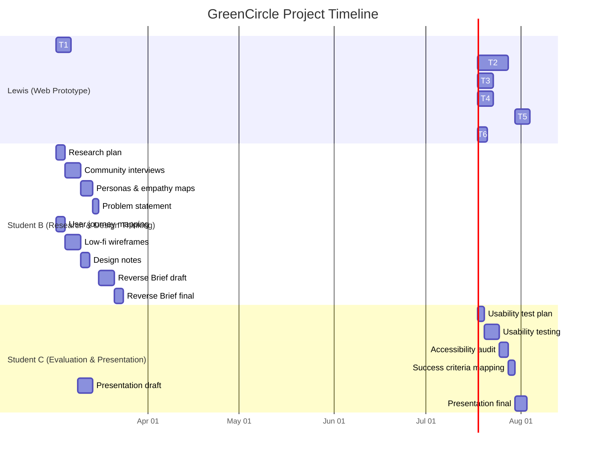

# GreenCircle — Gantt Chart & Task Allocation

**Duration:** 6 weeks (adjust for term length)  
**Team:** 3 students — Lewis builds web prototype (Cursor); B & C do design thinking

---

## Mermaid Gantt Chart

---

## Week-by-Week Allocation

| Week | Lewis | Student B | Student C |
|------|-------|-----------|-----------|
| **1** | T1: Scaffold | Research plan, interviews, journey mapping | — |
| **2** | T2: Core features | Personas, empathy maps, wireframes; hand off to Lewis | Draft presentation outline |
| **3** | T2: Core features | Problem statement, Reverse Brief draft | Usability test plan |
| **4** | T3: Admin & charts | Reverse Brief draft, design notes | Run usability tests (Lewis's prototype) |
| **5** | T4: i18n & polish | Reverse Brief final | Test report, accessibility audit, success criteria |
| **6** | T5: Feedback integration, T6: Deploy | Review & support | Presentation final |

---

## Task Checklist by Student

### Lewis Checklist

- [ ] T1: Scaffold (T3 stack, Prisma, NextAuth, routes)
- [ ] T2: Core features (dashboard, bookings, reports, challenges)
- [ ] T3: Admin & charts (dashboard, user management)
- [ ] T4: i18n & polish (locales, UI refinements)
- [ ] T5: Apply feedback from B & C
- [ ] T6: Documentation & deploy
- [ ] Receive personas, journey maps, wireframes from B by Week 2
- [ ] Receive usability report and audit from C by Week 5

### Student B Checklist

- [ ] Research plan (who, what questions, when)
- [ ] 3–5 interview notes (summary + quotes)
- [ ] 2–3 persona cards (name, goals, frustrations, segment)
- [ ] Empathy maps for key personas
- [ ] Problem statement (1 paragraph)
- [ ] User journey map: resident (report issue)
- [ ] User journey map: resident (join challenge)
- [ ] User journey map: admin (post announcement)
- [ ] Low-fidelity wireframes (5+ key screens)
- [ ] Design notes: navigation rationale, accessibility choices
- [ ] Reverse Brief: community problem section
- [ ] Reverse Brief: target users section
- [ ] Reverse Brief: UX/design justification section
- [ ] Reverse Brief: finalised Word document
- [ ] Share personas, journey maps, wireframes with Lewis by end of Week 2

### Student C Checklist

- [ ] Usability test plan (tasks, participants, metrics)
- [ ] 2–3 usability test sessions (on Lewis's prototype)
- [ ] Usability test report (findings, severity)
- [ ] Accessibility audit (WCAG check)
- [ ] Success criteria checklist (all 5 items)
- [ ] Presentation: problem slide
- [ ] Presentation: target users slide
- [ ] Presentation: key features slide
- [ ] Presentation: user journeys slide
- [ ] Presentation: how design meets needs
- [ ] Presentation: final PowerPoint
- [ ] Share test report and audit with Lewis by end of Week 5

---

## Handoff Schedule

| From | To | What | When |
|------|-----|------|------|
| Student B | Lewis | Personas, journey maps, wireframes | Week 2 |
| Lewis | Student C | Web prototype URL (for testing) | Week 4 |
| Student C | Lewis | Usability report, accessibility audit | Week 5 |
| All | — | Reverse Brief, Presentation | Week 6 |

---

## Success Criteria Cross-Check

| Criterion | Evidence Source |
|-----------|-----------------|
| Targets local community members | Reverse Brief §2, Personas (B) |
| UX design principles applied | Design notes, wireframes (B) |
| User-centred design thinking | Research, usability report (B, C) |
| Logical, accessible, realistic | Usability report, accessibility audit (C) |
| Computing Technology links | Presentation, Reverse Brief |
