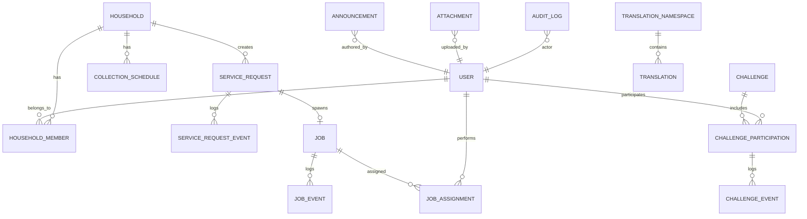

# ER Diagram (Mermaid)

```mermaid
erDiagram
  USER ||--o{ HOUSEHOLD_MEMBER : belongs_to
  HOUSEHOLD ||--o{ HOUSEHOLD_MEMBER : has
  HOUSEHOLD ||--o{ COLLECTION_SCHEDULE : has
  HOUSEHOLD ||--o{ SERVICE_REQUEST : creates
  SERVICE_REQUEST ||--o{ SERVICE_REQUEST_EVENT : logs
  SERVICE_REQUEST ||--o| JOB : spawns
  JOB ||--o{ JOB_EVENT : logs
  JOB ||--o{ JOB_ASSIGNMENT : assigned
  USER ||--o{ JOB_ASSIGNMENT : performs
  CHALLENGE ||--o{ CHALLENGE_PARTICIPATION : includes
  USER ||--o{ CHALLENGE_PARTICIPATION : participates
  CHALLENGE_PARTICIPATION ||--o{ CHALLENGE_EVENT : logs
  ANNOUNCEMENT }o--|| USER : authored_by
  TRANSLATION_NAMESPACE ||--o{ TRANSLATION : contains
  ATTACHMENT }o--|| USER : uploaded_by
  AUDIT_LOG }o--|| USER : actor
```
